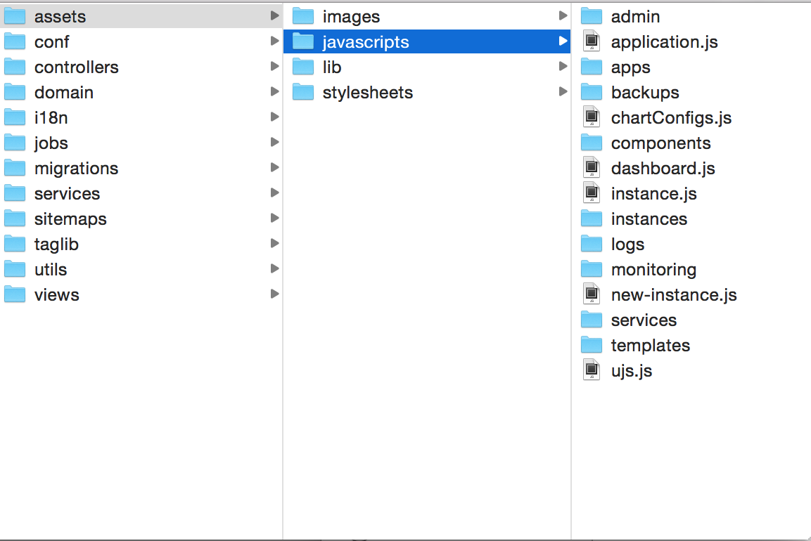
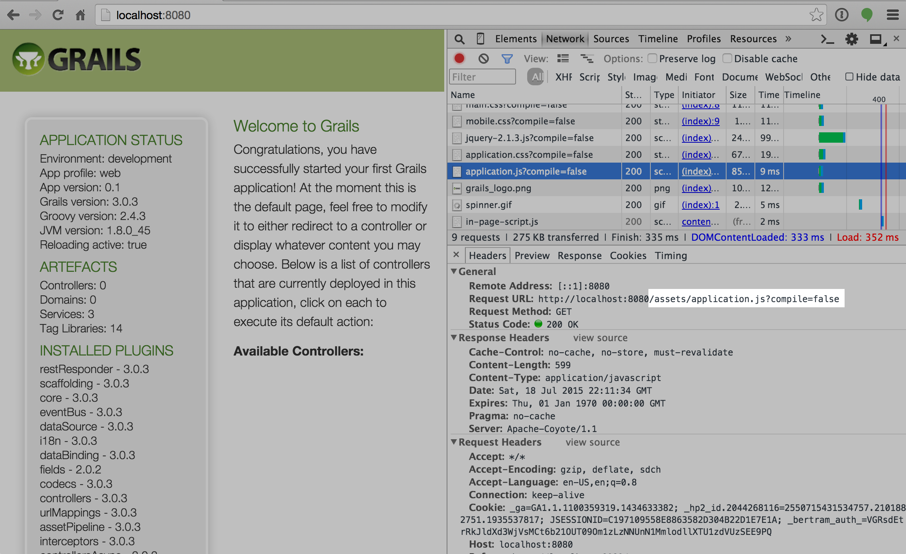
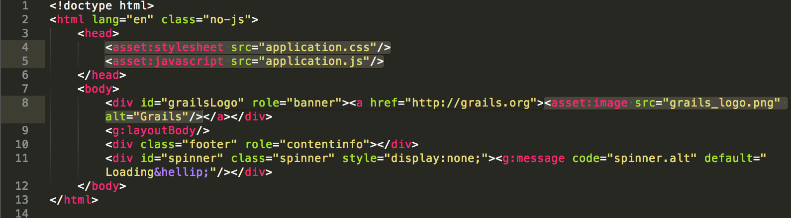
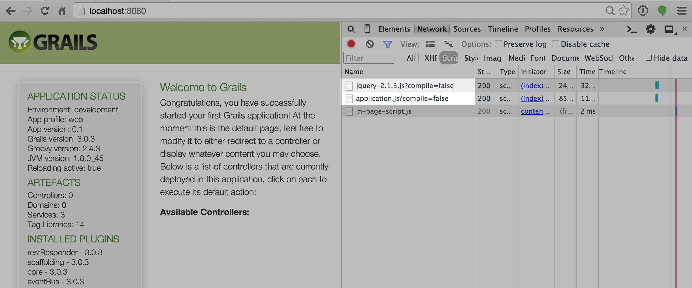
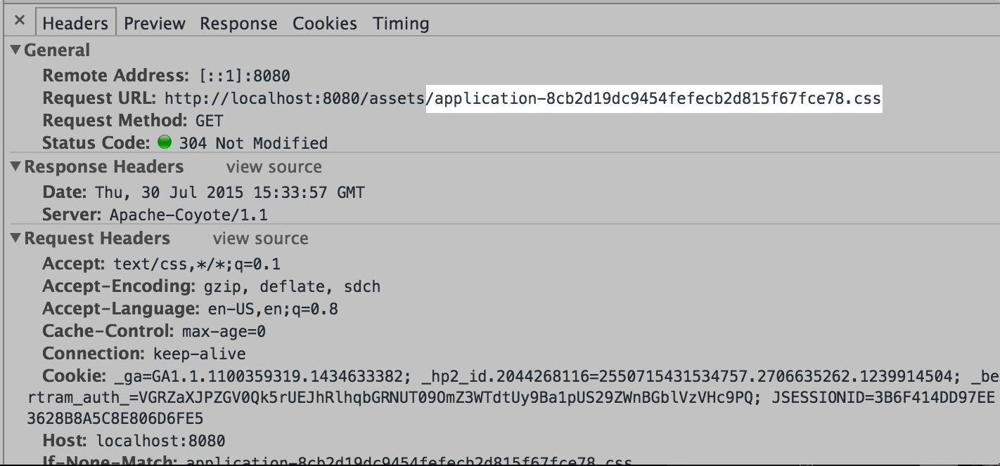

slidenumbers: true


## Presented by David Estes (@davydotcom) __#asset-pipeline__
## [www.asset-pipeline.com](http://www.asset-pipeline.com)


[www.morpheusdata.com](http://www.morpheusdata.com)

---

# What is Asset-Pipeline?

A library for both rapid development iteration and optimized production handling of static and not-so-static assets.

---

# Where did it come from?

Asset-Pipeline is inspired by the Sprockets asset-pipeline used in Rails. But it is by no means the same as a lot of the negatives of Sprockets have been solved in this plugin. 

* Why Replace Resources Plugin?
* No need for url replacement Helpers
* Reliable Build Consistency
* Simpler Extensibility

---

# What will we cover?

* Development cycle: On the fly processing and transpiling of assets
* Popular extension plugins
* Production tuning with Grails
* Digesting and cache headers
* Extending
* Other frameworks

--- 

# What's New

* 3.0.3 Released Today!
* Performance
* JSX Stable
* ES2017 Support (via Babel.js)
* CommonJs Support
* Parallel Compile
* `index.html` resolution
* Root Level Resolution
* Micronaut Support!!!

---

# What's Coming

* Pluggable Encoders
* VueJs Support
* Brotli Support
* TypeScript Support
* Hot Module Reloading
* Source Maps


---

# The 'assets' folder

* First subfolder is for organizational use. (i.e. images, fonts, stylesheets,javascripts)
* This is never used in the request path and is essentially flattened out



---

While the file is stored in `assets/javascripts/application.js`, the request is simply made at: `/assets/application.js`



---

# Resolvers

The means with which the asset-pipeline resolves files requested as well as imported. There are several base resolver types:

* Filesystem
* Jar
* Classpath
* Spring Resource

**NOTE**: Resolvers are only used in development mode as well as build time. They are not used during production.

---

# Grails Resolvers

Resolvers are registered for the main `grails-app/assets` folder and each plugin. 
* **Binary Plugins:** `META-INF/assets`. (pre-flattened)
* **Source Plugins:** `$pluginPath/grails-app/assets`
* **Binary Dependencies:** `META-INF/static` and `META-INF/resources`

---

# Gradle Resolvers

Customizable but defaults to the `src/assets` folder.

```groovy
assets {
  sourceDir = 'src/assets'
  compileDir = "$buildDir/assets"
  from '/path/to/another/set/of/assets'
}
```

---

# Bundling

* Directives
* CommonJs, ES Modules
* Encoding

---

# What are Directives

File annotations that allow for the inclusion of other files, as well as the assignment of file options.

* `//= require jquery`
* `//= require_tree .`
* `//= require_self`
* `//= encoding UTF8`

Can be Recursively scanned

---

# Bundling Javascript

Sample `application.js` file taken from grails: 

```javascript
// This is a manifest file that'll be compiled into application.js.
//
// Any JavaScript file within this directory can be referenced here using a relative path.
//
// You're free to add application-wide JavaScript to this file, but it's generally better 
// to create separate JavaScript files as needed.
//
//= require jquery-2.1.3.js
//= require_tree .
//= require_self

if (typeof jQuery !== 'undefined') {
    (function($) {
        $('#spinner').ajaxStart(function() {
            $(this).fadeIn();
        }).ajaxStop(function() {
            $(this).fadeOut();
        });
    })(jQuery);
}

```

---

# Bundling Javascript

ECMAScript 2017

```javascript
import React from 'react';
import ReactDOM from 'react-dom';
import App from 'App';

ReactDOM.render(<App />, document.getElementById('root'));
```

CommonJs

```javascript
var React = require('react');
var ReactDOM = require('react-dom');
var App = require('App');

ReactDOM.render(<App />, document.getElementById('root'));
```

---

# Bundling Stylesheets

Sample `application.css` taken from grails:

```css
/*
* This is a manifest file that'll be compiled into application.css, which will include all the files
* listed below.
*
* Any CSS file within this directory can be referenced here using a relative path.
*
* You're free to add application-wide styles to this file and they'll appear at the top of the
* compiled file, but it's generally better to create a new file per style scope.
*
*= require main
*= require mobile
*= require_self
*/

```

---

# Encoding

Source encoding can be specified within each individual javascript file

```javascript
//=encoding UTF-8
```

Output encoding can be customized with param:

```
http://localhost:8080/assets/application.js?encoding=utf-8
```

---

# Taglibs

* Javascript
*  Stylesheets
* Images
* Deferred scripts

---

# Sample Grails Layout



*NOTE*: No Need to specify `assets/` folder in path

---

# Debug Mode

In Development the taglib will include each file individually rather than bundled. This makes it easier to debug your javascript in real time



---

# Making Development more like Production

Assets can be bundled instead of split during development mode for more consistent behavior between development and production

```yaml
grails:
    assets:
        bundle: true
```

---

# Deferred Scripts

Added to facilitate easier transition from the Resources plugin but not recommended.

```jsp
<asset:javascript src="test.js" asset-defer="true"/>
<asset:script type="text/javascript">
  console.log("Hello World");
</asset:script>
```

Now to render the output of these scripts simply use the following:

```jsp
<asset:deferredScripts/>
```
---

# Javascript Helpers

```javascript
var logo = asset_path('logo.png')
```

or CommonJs / ECMAScript 2017

```javascript
var logoUrl = require('logo.png');
```

Can now seemlessly reference assets from javascript with proper names

---

# HTML Files are processed

It is possible to develop the entire view layer of an application with the asset-pipeline only now. HTML files even get similar treatment with relative url replacement of asset patterns automatically performed.

Use gradle multiproject builds for this as well.

---

# Scoping Javascript to a Page

Use a `class` or `data-page` attribute on your body tag to selectively trigger javascript. This allows you to seperate your javascript from your view and keep it all bundled in one file.

Or

Use a SPA Framework

---

# On the fly

* Why not watched?
*  Cache Trees
* More supportive of external build tools like webpack

---

# Why not Watched Files?

* Slow
* Delay between saving and being able to refresh your browser
* Gets exponentially worse the bigger the project
* Doesn't stack well with other watch type transpilers in a project

---

# Instant Gratification

When a file is changed, you can refresh your browser and see your changes instantly. Allows for a faster iteration. 

Simpler than HMR, but works for broaders styles and types of javascript assets

---

# Development Runtime Cache

Processed files are cached in memory, and given a cache dependency tree. Asset-Pipeline serves from this cache unless the file has changed since the last cache. This cache is now also persisted to disk

(Yes it is called the `.asscache`)

---

# Webpack, Gulp, and Grunt

* Not just a build tool
* Tightly integrated with your framework for a more seemless workflow
* No watched resources in development
* Less development dependencies
* Significantly faster build times

---

# CSS Goodies

* Recalculated relative urls
* Minification

---

# LESS 

```groovy
compile 'com.bertramlabs.plugins:less-asset-pipeline:x.x.x'
```

* Standard vs. Less4j
* Use less4j
* Clean debugging output in your logs
* Use imports instead of directives

^ Talk about naming files with `.less` extension but still requesting them as `.css`

---

# CoffeeScript

```groovy
compile 'com.bertramlabs.plugins:coffee-asset-pipeline:x.x.x'
```

* Each file is isolated scoped
* Different directive pattern `#= require blah`
* Uses nodejs coffee plugin if detected for faster compile

^ Talk about `.coffee` extension and debugging support

---

# Handlebars

```groovy
compile 'com.bertramlabs.plugins:handlebars-asset-pipeline:x.x.x'
```

* Bundle all templates in one js file (template cache)
* Configurable template prefix to control your template names by path
* Embedded handlebars library, or override by including your own

--- 

# SASS

```groovy
compile 'com.bertramlabs.plugins:sass-asset-pipeline:x.x.x'
```

* Powerful, elegant, and Fast!
* Now uses Libsass (via JSASS) thanks to work by @gferon

---

# SASS Customizations

Custom Importers registered to even be able to import sass files from binary plugins

---

# JSX

* Native java parser (lexxer) [JSXLexer.jflex](https://github.com/bertramdev/asset-pipeline/blob/master/jsx-asset-pipeline/src/main/jflex/asset/pipeline/jsx/JsxLexer.jflex)
* No javascript runtime required to generate
* Supports ES2017 javascript concepts
* Faster!

---

# CommonJs Module Support

Webpack like native support built into asset-pipeline. All the speed benefits you get with the JVM, combined with standards used by frontend developers.

Asset-Pipeline uses a very efficient means to gather up modules and inject them into the javascript using a special method injected called `_asset_pipeline_require()`. See [JsRequireProcessor](https://github.com/bertramdev/asset-pipeline/blob/master/asset-pipeline-core/src/main/groovy/asset/pipeline/processors/JsRequireProcessor.groovy)

---

# ES2017 Javascript Support

By default on for any js file ending in `.es` or `.js.es`. It Also works with `.jsx.es` and includes ES2017 Module suport!

```jsx
import React from 'react';

class HelloWorld extends React.Component {
    render() {
        return <h1>Hello from {this.props.phrase}!</h1>;
    }
}

export default HelloWorld;
```

---

# ES2017 Javascript Support

Can be enabled across standard `.js` extensions as well via a configuration flag in `build.gradle` and grails config.

```groovy
assets {
    configOptions = [enableES6: true]
}
```

```yaml
grails:
    assets:
        enableES6: true
```

---

# React Support

* The `jsx-asset-pipeline` library combined with tools like the `client-dependencies` plugin make using React JS simple.
* Can Also use WebPack

---

# Production!

* Digests
* Etags
* CDNs
* External storagepath
* Custom request urls
* Minification
* More SPEED!

---

# Digests

MD5 Suffiix appended to the end of a filename. Used for cache busting consistently across browsers and proxies. i.e.



^ Also useful for rolling restarts (more on that later)

---

# ETAGS

ETags are a request and response header that can be used to determine if a file being requested on the server vs. the clients copy of a file has changed at all. This is done using the `If-None-Match` request header. If it is a match the server can send a 304 Unmodified response with no body.

---

# CDNS - Benefits

CDNS Can be placed in front of an application and automatically know what files need to be cached at various edge servers, vs. what needs passed through when requested. 

Files can also be transferred at startup to a CDN or Object Store like Amazon S3 or Azure Object Storage using Karman and `cdn-asset-pipeline`.

---
# CDNS - Benefits

Asset-pipeline Supports changing the asset base url so that it can be configured to request assets from target CDNS:

```groovy
grails {
  assets {
    url = 'http://cdn.amazonaws.com/mysite/'
  }
}
```

---

# CDNS - Benefits

The url can also be passed a `Closure` that gets the request object as its first parameter. (Potentially useful for changing the url based on region)

---

# Packaging

* Assets are packaged in your container's `assets` folder along with a manifest.properties file.
* Manifest allows for both diff level compiling and proper etags when requesting by non digested name
* We don't force digest only request handling.

---

# Excludes / Includes

* Partial files are automatically excluded `**/_*.*`
* Common patterns
	* Uses GLOB patterns i.e. `**/*.js` or `**/*.less`
* Common mistakes
	* Don't factor in your organizational assets subfolders
* [github.com/craigburke/client-dependencies-gradle](https://github.com/craigburke/client-dependencies-gradle)

---

# JS Minification

* Closure compiler uses Rhino's AST parser (not runtime)
* Sourcemaps

---

# CSS Minification

* Simple Whitespace processing
* Duplicate Rules are not merged yet

---

# Gradle Standalone

Creating a simple static site can be done super easily!

```
plugins {
  id "com.bertramlabs.asset-pipeline" version "3.0.3"
}
```

DEMO

---

# Ratpack and Asset-Pipeline

```
ratpack {
  bindings {
    module(AssetPipelineModule) { cfg ->
      cfg.url("/")
      cfg.sourcePath("../../../src/assets")
    }
  }
```

[Sample Site](https://github.com/bertramdev/asset-pipeline/tree/master/asset-pipeline-site)

---

# Micronaut and Asset-Pipeline


```

dependencies {
  runtime 'com.bertramlabs.plugins:asset-pipeline-micronaut:3.0.3'
}

```

EXAMPLE

---

# Extending (Asset File Definitions)

```groovy
class CssAssetFile extends AbstractAssetFile {
  static final String contentType = 'text/css'
  static extensions = ['css']
  static compiledExtension = 'css'
  static processors = [CssProcessor]

  String directiveForLine(String line) {
    line.find(/\*=(.*)/) { fullMatch, directive -> return directive }
  }
}
```

---

# Extending (Processors)

```groovy
class CoffeeScriptProcessor extends AbstractProcessor {
  Scriptable globalScope
  ClassLoader classLoader
  CoffeeScriptProcessor(AssetCompiler precompiler){
    super(precompiler)
  }

  String process(String input, AssetFile assetFile) {
    try {
      def cx = Context.enter()
      def compileScope = cx.newObject(globalScope)
      compileScope.setParentScope(globalScope)
      compileScope.put("coffeeScriptSrc", compileScope, input)
      def result = cx.evaluateString(compileScope, "CoffeeScript.compile(coffeeScriptSrc)", "CoffeeScript compile command", 0, null)
      return result
    } catch (Exception e) {
      throw new Exception("""
        CoffeeScript Engine compilation of coffeescript to javascript failed.
        $e
        """)
    } finally {
      Context.exit()
    }
  }
}
```

---

# Extending (Processors)

### Why not just call node libraries?

* Resolvers need to be accounted for... Files may not be on the filesystem!
* Processors that run in javascript occasionally need to call back into Groovy for file resolution [Less Example](https://github.com/bertramdev/asset-pipeline/blob/master/less-asset-pipeline/src/main/resources/asset/pipeline/less/compile.js#L16)
* Processors can export additional files (sprite generators or source maps)

---

# Extending (Processors)

* Processors sometimes need to update cache dependencies when injecting other assets (i.e. [SASS](https://github.com/bertramdev/asset-pipeline/blob/master/sass-asset-pipeline/src/main/groovy/asset/pipeline/jsass/SassAssetFileImporter.groovy#L70))


--- 

# Extending Definitions

META-INF/asset-pipeline/asset.specs

```
asset.pipeline.HtmlAssetFile
asset.pipeline.JsAssetFile
asset.pipeline.CssAssetFile
```

processor.specs

```
asset.pipeline.CssProcessor=asset.pipeline.CssAssetFile,asset.pipeline.LessAssetFile
```

---

# Other Plugins

* cdn-asset-pipeline
* angular-templates-asset-pipeline
* ember-asset-pipeline
* more... [www.asset-pipeline.com/plugins](http://www.asset-pipeline.com/plugins)

---

# Additional Resources

* __Website:__ [www.asset-pipeline.com](http://www.asset-pipeline.com)
* __Github:__ [http://github.com/bertramdev/asset-pipeline](http://github.com/bertramdev/asset-pipeline)

---

# Questions?
